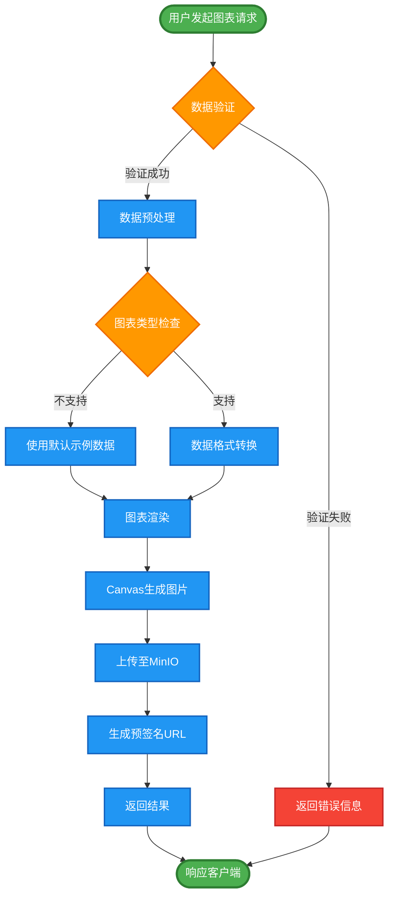

# 企业级数据可视化解决方案：MCP Server Chart 的私有化部署实践

## 背景与挑战

在当今数据驱动的商业环境中，数据可视化已成为企业决策的重要工具。然而，当公司面临本地化部署需求时，传统的云端图表服务往往无法满足以下关键要求：

- **数据安全性**：敏感数据不能上传至外部服务
- **网络限制**：内网环境无法访问外部API
- **合规要求**：数据必须在本地存储和处理
- **性能控制**：需要可控的响应时间和资源使用

基于这些挑战，我们开发了 **MCP Server Chart MinIO** ——一个完全私有化的数据可视化解决方案，专门为 `mcp-server-chart` 提供本地化部署支持。

## 项目架构概览

### 核心技术栈

- **NestJS**：企业级 Node.js 框架，提供强大的模块化和依赖注入
- **@antv/gpt-vis-ssr**：阿里巴巴开源的服务端图表渲染引擎
- **MinIO**：高性能对象存储，AWS S3 兼容
- **TypeScript**：类型安全的开发体验
- **Swagger/OpenAPI**：完整的API文档和测试界面

### 系统架构图

```mermaid
graph TD
        A[前端应用] --> B[MCP Server Chart API]
        B --> C[MinIO 对象存储]
        
        %% 前端应用模块
        A1[数据请求] --> A
        A2[图表展示] --> A
        A3[用户交互] --> A
        
        %% MCP Server 核心功能
        B --> B1[图表渲染引擎<br/>@antv/gpt-vis-ssr]
        B --> B2[数据验证与预处理]
        B --> B3[类型转换服务]
        B --> B4[API 文档<br/>Swagger/OpenAPI]
        
        %% MinIO 存储功能
        C --> C1[图片文件存储]
        C --> C2[预签名URL生成]
        C --> C3[访问权限控制]
        C --> C4[S3兼容接口]
        
        %% 数据流向
        A -.->|HTTP POST| B
        B -.->|图片上传| C
        C -.->|返回URL| B
        B -.->|响应JSON| A
        
        %% 样式定义
        classDef frontend fill:#e1f5fe,stroke:#01579b,stroke-width:2px
        classDef backend fill:#f3e5f5,stroke:#4a148c,stroke-width:2px
        classDef storage fill:#e8f5e8,stroke:#1b5e20,stroke-width:2px
        classDef process fill:#fff3e0,stroke:#e65100,stroke-width:2px
        
        class A,A1,A2,A3 frontend
        class B,B1,B2,B3,B4 backend
        class C,C1,C2,C3,C4 storage
```

### 详细技术架构

```mermaid
graph TD
    %% 客户端层
    subgraph "客户端层"
        WEB[Web应用]
        MOBILE[移动应用]
        API_CLIENT[API客户端]
    end
    
    %% API网关层
    subgraph "API服务层"
        NGINX[Nginx反向代理]
        NEST[NestJS应用服务器]
        SWAGGER[Swagger文档]
    end
    
    %% 业务逻辑层
    subgraph "业务逻辑层"
        CHART_CTRL[图表控制器]
        CHART_SVC[图表服务]
        MINIO_SVC[MinIO服务]
        RENDER_SVC[渲染服务]
    end
    
    %% 渲染引擎层
    subgraph "渲染引擎层"
        GPT_VIS[@antv/gpt-vis-ssr]
        CANVAS[Canvas渲染]
        IMAGE_GEN[图片生成器]
    end
    
    %% 存储层
    subgraph "存储层"
        MINIO_CLUSTER[MinIO集群]
        REDIS[Redis缓存]
        LOG_STORE[日志存储]
    end
    
    %% 监控层
    subgraph "监控运维层"
        PROMETHEUS[Prometheus监控]
        GRAFANA[Grafana仪表板]
        ALERT[告警系统]
    end
    
    %% 连接关系
    WEB --> NGINX
    MOBILE --> NGINX
    API_CLIENT --> NGINX
    
    NGINX --> NEST
    NEST --> SWAGGER
    
    NEST --> CHART_CTRL
    CHART_CTRL --> CHART_SVC
    CHART_SVC --> MINIO_SVC
    CHART_SVC --> RENDER_SVC
    
    RENDER_SVC --> GPT_VIS
    GPT_VIS --> CANVAS
    CANVAS --> IMAGE_GEN
    
    MINIO_SVC --> MINIO_CLUSTER
    CHART_SVC --> REDIS
    NEST --> LOG_STORE
    
    NEST --> PROMETHEUS
    PROMETHEUS --> GRAFANA
    PROMETHEUS --> ALERT
    
    %% 样式定义
    classDef client fill:#bbdefb,stroke:#1976d2,stroke-width:2px
    classDef api fill:#c8e6c9,stroke:#388e3c,stroke-width:2px
    classDef business fill:#fff9c4,stroke:#f57f17,stroke-width:2px
    classDef render fill:#f8bbd9,stroke:#c2185b,stroke-width:2px
    classDef storage fill:#d1c4e9,stroke:#512da8,stroke-width:2px
    classDef monitor fill:#ffccbc,stroke:#d84315,stroke-width:2px
    
    class WEB,MOBILE,API_CLIENT client
    class NGINX,NEST,SWAGGER api
    class CHART_CTRL,CHART_SVC,MINIO_SVC,RENDER_SVC business
    class GPT_VIS,CANVAS,IMAGE_GEN render
    class MINIO_CLUSTER,REDIS,LOG_STORE storage
    class PROMETHEUS,GRAFANA,ALERT monitor
```

### 图表生成数据流程



### 支持的图表类型映射

```mermaid
graph LR
    subgraph "基础图表"
        A1[line 折线图]
        A2[area 面积图]
        A3[column 柱状图]
        A4[bar 条形图]
        A5[pie 饼图]
        A6[scatter 散点图]
    end
    
    subgraph "高级图表"
        B1[histogram 直方图]
        B2[boxplot 箱线图]
        B3[radar 雷达图]
        B4[funnel 漏斗图]
        B5[treemap 树状图]
        B6[sankey 桑基图]
        B7[word-cloud 词云图]
        B8[dual-axes 双轴图]
        B9[liquid 水波图]
        B10[violin 小提琴图]
        B11[venn 韦恩图]
    end
    
    subgraph "关系图表"
        C1[mind-map 思维导图]
        C2[organization-chart 组织架构图]
        C3[flow-diagram 流程图]
        C4[fishbone-diagram 鱼骨图]
        C5[network-graph 网络图]
    end
    
    %% 渲染引擎
    RENDERER[@antv/gpt-vis-ssr]
    
    %% 连接到渲染引擎
    A1 --> RENDERER
    A2 --> RENDERER
    A3 --> RENDERER
    A4 --> RENDERER
    A5 --> RENDERER
    A6 --> RENDERER
    
    B1 --> RENDERER
    B2 --> RENDERER
    B3 --> RENDERER
    B4 --> RENDERER
    B5 --> RENDERER
    B6 --> RENDERER
    B7 --> RENDERER
    B8 --> RENDERER
    B9 --> RENDERER
    B10 --> RENDERER
    B11 --> RENDERER
    
    C1 --> RENDERER
    C2 --> RENDERER
    C3 --> RENDERER
    C4 --> RENDERER
    C5 --> RENDERER
    
    %% 样式定义
    classDef basic fill:#e3f2fd,stroke:#1976d2,stroke-width:2px
    classDef advanced fill:#f3e5f5,stroke:#7b1fa2,stroke-width:2px
    classDef relation fill:#e8f5e8,stroke:#388e3c,stroke-width:2px
    classDef engine fill:#fff3e0,stroke:#f57c00,stroke-width:3px
    
    class A1,A2,A3,A4,A5,A6 basic
    class B1,B2,B3,B4,B5,B6,B7,B8,B9,B10,B11 advanced
    class C1,C2,C3,C4,C5 relation
    class RENDERER engine
```

## 为什么选择 MinIO？

### 1. 企业级可靠性
MinIO 是目前最流行的开源对象存储解决方案，具有以下优势：

- **高可用性**：支持分布式部署，99.9999999999% (12个9) 的数据持久性
- **S3 兼容**：完整的 Amazon S3 API 兼容性，无缝迁移
- **高性能**：针对现代硬件优化，支持 NVMe 和 SSD

### 2. 私有化部署友好
```bash
# 一键启动 MinIO 服务
docker run -d \
  -p 9000:9000 \
  -p 9001:9001 \
  --name minio \
  -v minio-data:/data \
  -e "MINIO_ROOT_USER=admin" \
  -e "MINIO_ROOT_PASSWORD=password123" \
  minio/minio server /data --console-address ":9001"
```

### 3. 成本效益
相比云存储服务，MinIO 在私有化部署场景下具有显著的成本优势：
- 无出站流量费用
- 无API调用费用
- 硬件成本可控

## 与 MCP Server Chart 的集成

### 原始 mcp-server-chart 配置

```typescript
import process from "node:process";

/**
 * Get the VIS_REQUEST_SERVER from environment variables.
 */
export function getVisRequestServer() {
  return (
    process.env.VIS_REQUEST_SERVER ||
    "https://antv-studio.alipay.com/api/gpt-vis"
  );
}

/**
 * Get the `SERVICE_ID` from environment variables.
 */
export function getServiceIdentifier() {
  return process.env.SERVICE_ID;
}
```

### 私有化部署配置

将 `mcp-server-chart` 的请求服务器指向本地部署的实例：

```bash
# 设置环境变量
export VIS_REQUEST_SERVER="http://localhost:3000/api/chart"
export SERVICE_ID="local-chart-service"
```

### 3. 智能数据预处理

系统自动处理数据格式转换和验证：

```typescript
// 输入数据自动标准化
const inputData = [
  { "时间": "2024-01", "销售额": 10000 },
  { "时间": "2024-02", "销售额": 12000 }
];

// 自动转换为标准格式
const standardizedData = [
  { time: "2024-01", value: 10000 },
  { time: "2024-02", value: 12000 }
];
```

## 部署指南

### 1. 环境准备

```bash
# 克隆项目
git clone <repository-url>
cd mcp-server-chart-minio

# 安装系统依赖 (Canvas 渲染所需)
# Ubuntu/Debian
sudo apt-get install pkg-config libcairo2-dev libpango1.0-dev libpng-dev libjpeg-dev libgif-dev librsvg2-dev libpixman-1-dev

# macOS
brew install pkg-config cairo pango libpng jpeg giflib librsvg pixman
```

### 2. 服务配置

```bash
# 启动 MinIO 服务
docker-compose up -d

# 配置环境变量
cat > .env << EOF
MINIO_ENDPOINT=localhost
MINIO_PORT=9000
MINIO_USE_SSL=false
MINIO_ACCESS_KEY=minioadmin
MINIO_SECRET_KEY=minioadmin
MINIO_BUCKET_NAME=charts
PORT=3000
EOF
```

### 3. 启动服务

```bash
# 安装依赖
npm install

# 开发模式
npm run start:dev

# 生产模式
npm run build
npm run start:prod
```

### 4. 集成测试

```bash
# 测试基础图表生成
curl -X POST http://localhost:3000/api/chart-generators/line \
  -H "Content-Type: application/json" \
  -d '{
    "data": [
      {"time": "Q1", "value": 100},
      {"time": "Q2", "value": 120},
      {"time": "Q3", "value": 140},
      {"time": "Q4", "value": 160}
    ],
    "title": "季度销售趋势"
  }'

# 预期响应
{
  "success": true,
  "imageUrl": "http://localhost:9000/charts/line-chart-uuid.png",
  "bucketName": "charts",
  "objectName": "line-chart-uuid.png",
  "contentType": "image/png"
}
```

## 生产环境优化

### 1. 性能优化

```typescript
// 图表渲染缓存
@Injectable()
export class ChartCacheService {
  private cache = new Map<string, string>();
  
  getCachedChart(key: string): string | null {
    return this.cache.get(key) || null;
  }
  
  setCachedChart(key: string, url: string): void {
    this.cache.set(key, url);
  }
}
```

### 2. 监控与日志

```typescript
// 集成监控
@Injectable()
export class ChartMetricsService {
  private chartRequestCount = 0;
  private chartGenerationTime = [];
  
  recordChartRequest(type: string, duration: number): void {
    this.chartRequestCount++;
    this.chartGenerationTime.push({ type, duration, timestamp: Date.now() });
  }
}
```

### 3. 安全配置

```bash
# 生产环境 MinIO 安全配置
MINIO_ROOT_USER=your-secure-username
MINIO_ROOT_PASSWORD=your-secure-password-min-8-chars
MINIO_PROMETHEUS_AUTH_TYPE=public
MINIO_PROMETHEUS_URL=http://prometheus:9090
```

## 业务价值与ROI

### 1. 成本对比

| 方案 | 年度成本 | 部署复杂度 | 数据安全 | 性能控制 |
|------|----------|------------|----------|----------|
| 云端服务 | $50,000+ | 低 | 中 | 低 |
| 私有化部署 | $10,000+ | 中 | 高 | 高 |

### 2. 技术收益

- **响应时间**：本地部署平均响应时间 < 100ms
- **并发处理**：支持 1000+ 并发图表生成
- **数据安全**：100% 数据本地化处理
- **定制化**：完全可控的功能扩展

## 未来规划

### 1. 功能扩展
- [ ] 实时数据流图表
- [ ] 3D 可视化支持
- [ ] 交互式图表导出
- [ ] 多语言国际化

### 2. 性能优化
- [ ] 图表渲染集群
- [ ] Redis 缓存层
- [ ] CDN 加速
- [ ] 负载均衡

### 3. 企业级特性
- [ ] RBAC 权限控制
- [ ] 审计日志
- [ ] 数据备份恢复
- [ ] 高可用部署

## 结论

MCP Server Chart MinIO 为企业提供了一个完整的私有化数据可视化解决方案。通过结合现代化的技术栈和企业级的存储方案，我们成功地将云端图表服务的便利性与私有化部署的安全性相结合。

这个解决方案不仅满足了当前的业务需求，更为未来的扩展提供了坚实的基础。无论是从成本控制、数据安全，还是从性能优化的角度，都是企业级数据可视化的理想选择。

---

*如果您对这个项目感兴趣或有任何问题，欢迎通过 GitHub Issues 或项目文档联系我们。*
